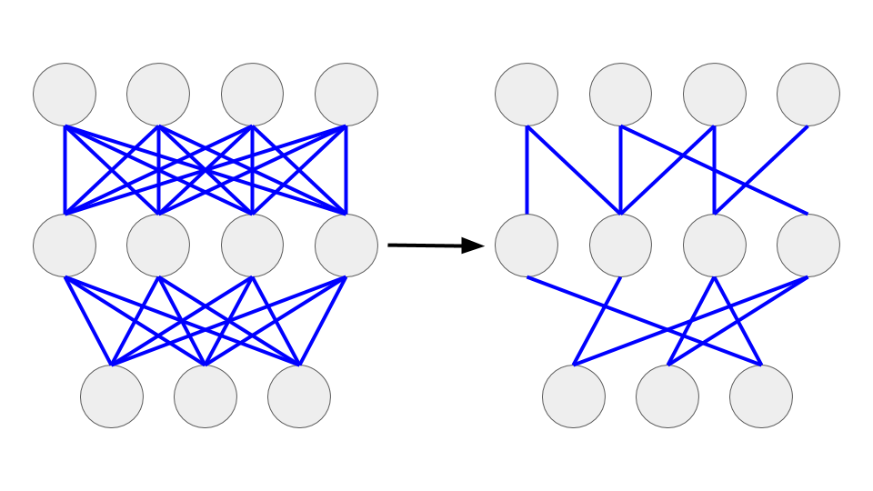
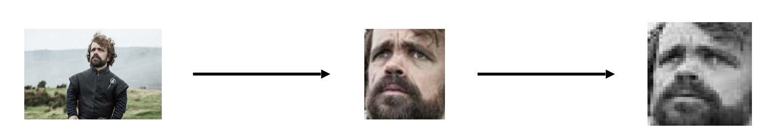
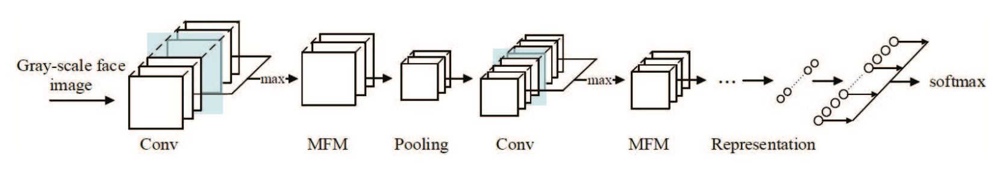

<!-- PROJECT LOGO -->
 

  

  <h3 align="center">Weight loss for machine learning</h3>

  

  A study on pruning and the Lottery Ticket Hypothesis.
  

<!-- TABLE OF CONTENTS -->
## Table of Contents

* [About the Project](#about-the-project)
  * [Built With](#built-with)
* [What is pruning?](#what-is-pruning)
  * [Why use pruning](#why-use-pruning)
  * [How does it work](#how-does-it-work)
  * [The Lottery Ticket Hypothesis](#the-lottery-ticket-hypothesis)
* [Facial Recognition](#facial-recognition)
  * [Dataset](#dataset)
  * [Pipeline](#pipeline)
* [License](#license)
* [Contact](#contact)
* [Acknowledgements](#acknowledgements)

<!-- ABOUT THE PROJECT -->
## About The Project
 The goal of this project is to understand the concept of pruning for neural networks. 
 Two networks can be pruned: an image classifier built with a fully connected network trained on MNIST, and a facial recognition model trained on a custom dataset.
The reinitialization method presented in the Lottery Ticket Hypothesis paper can be tested on both models.

### Built With

The project was coded in Pytorch.

## What is pruning?
Pruning is a technique that allows to reduce the size of a neural network by removing some of its branches.

### Why use pruning?
Let's first have a look at why pruning is used.

Running a ML model can be computationally expensive in terms of:
* Disk Space
* Memory usage
* CPU/GPU runtime

There is a strong incentive in making the machine learning models as small as possible to reduce their costs.

There are several techniques to reduce the size and the computing time of a model: quantization/binarization, knowledge distillation, low-rank factorization, parameters pruning... Several of these techniques can be used together to optimally compress a model.
We will study pruning in this project.

### How does it work?
Once a model has been trained, some of the parameters are deleted according to a given criteria. 
The most common is to delete weights if their absolute value is too low.

  

In this project, for each layer I deleted the 20% of the weights having the lowest absolute value. I then retrain the model and reiterate until the portion of the weights I want to remove has been deleted.

### The Lottery Ticket Hypothesis

The original paper can be found here:
[https://arxiv.org/abs/1803.03635](https://arxiv.org/abs/1803.03635)

## Facial Recognition

### Dataset

The dataset contains facial images of seven characters from the TV series Game of Thrones.
The characters are:
1. Daenerys
2. Jon Snow
3. Varys
4. Tyrion 
5. Podrick
6. Grey Worm
7. Bronn

Images were collected from Google Images and each class was manually cleaned.
About 100 images per character were collected.

### Pipeline

Preprocessing: Faces in the images are detected with the MTCNN algorithm, cropped and saved as new images. Cropped face images are then resized to 144x144 and converted to grayscale.

  

Here are some examples of the images in the "Grey Worm/Jacob Anderson" class:

  

Grayscale images are used as input for the LightCNN facial recognition model.
More details about the model can be found on the project github [https://github.com/AlfredXiangWu/LightCNN](https://github.com/AlfredXiangWu/LightCNN) and the publication [https://arxiv.org/abs/1511.02683](https://arxiv.org/abs/1511.02683).

  

### Comparison of reinitialization methods

Below is a plot comparing the accuracy of the pruned model with 3 different reinitialization schemes used for the weights after pruning: Keep the trained values from the trained full model, use a random new set of values, or re-use the initialization values from the full model before training (the method tested in the lottery ticket hypothesis paper).

  

## License

Distributed under the MIT License. See `LICENSE` for more information.

## Contact

Guillaume Castex - g.castex117@gmail.com

Project Link: [https://github.com/gcastex/PruNet](https://github.com/gcastex/PruNet)

## Acknowledgements

* [https://github.com/gfrogat/prunhild](https://github.com/gfrogat/prunhild)
* [https://github.com/AlfredXiangWu/LightCNN](https://github.com/AlfredXiangWu/LightCNN)
* [https://github.com/00arun00/Pruning-Pytorch](https://github.com/00arun00/Pruning-Pytorch)
* [https://github.com/TropComplique/mtcnn-pytorch](https://github.com/TropComplique/mtcnn-pytorch)
* [https://github.com/othneildrew/Best-README-Template](https://github.com/othneildrew/Best-README-Template)
* [https://thenounproject.com/search/?q=scissors&i=974696#](https://thenounproject.com/search/?q=scissors&i=974696#) (scissors image used in logo)
